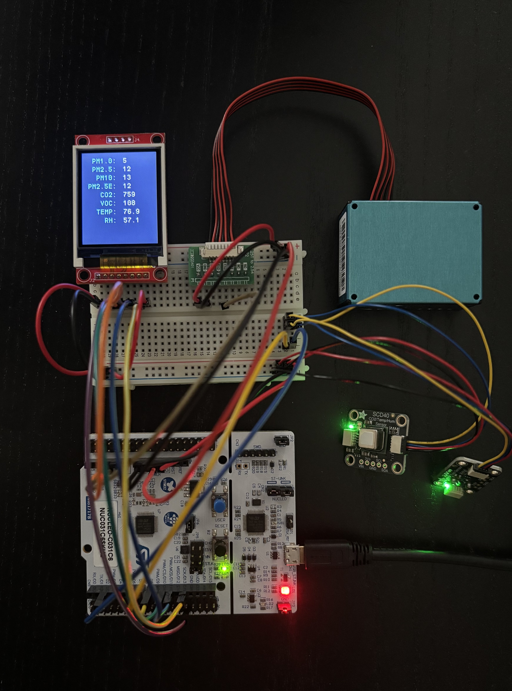
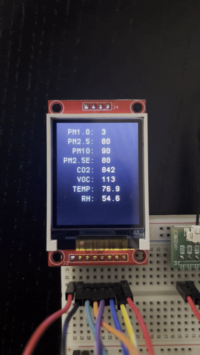

# Embedded Air Quality Monitor

A custom embedded air quality monitoring system built from scratch in C for an STM32 microcontroller. The system collects particulate matter, CO₂, temperature, humidity, and VOC measurements from multiple sensors and displays the readings on an ST7735 TFT display. I implemented the peripheral drivers at the register level without using the STM32 HAL, including UART, I2C, SPI, and SysTick configuration.

## Overview

Designed as a bare-metal embedded system with multiple sensors communicating over different hardware interfaces:

- **PMS5003** - Measures particulate matter concentrations using UART at 9600 baud.
- **SCD40** - Measures CO₂, temperature, and humidity using I2C.
- **SGP40** - Measures raw VOC values using I2C with CRC-8 validation.
- **ST7735** - Displays sensor measurements using SPI.
- **peripherals** - UART, I2C, SPI, GPIO, and SysTick are configured directly through STM32 registers without relying on the HAL library.

Sensor data is collected, validated, stored in a shared `AirQualityData` struct, and periodically copied into a local snapshot before being displayed.

## Architecture

- **main.c** - System initialization, sensor initialization, application loop, sensor polling, and display updates.
- **aqd.c / aqd.h** - Shared `AirQualityData` struct and safe snapshot functionality for sensor data.
- **pms5003.c / pms5003.h** - PMS5003 driver, UART frame synchronization, 32-byte frame reception, checksum validation, and particulate matter extraction.
- **scd40.c / scd40.h** - SCD40 driver, measurement commands, data-ready checking, CRC validation, and CO₂, temperature, and humidity conversion.
- **sgp40.c / sgp40.h** - SGP40 driver, raw VOC measurement commands, temperature/humidity compensation parameters, and CRC validation.
- **i2c1.c / i2c1.h** - Register-level I2C1 configuration and blocking read/write communication.
- **usart.c / usart.h** - Register-level USART1 configuration and timed byte reception for the PMS5003.
- **spi.c / spi.h** - Register-level SPI1 configuration for communication with the ST7735 display.
- **st7735.c / st7735.h** - Display interface and sensor data rendering.
- **utility.c / utility.h** - SysTick-based millisecond timing, delays, and numerical-to-string conversion utilities.

## Communication

The system uses multiple communication protocols depending on the peripheral:

- **UART** - PMS5003 particulate matter sensor.
- **I2C** - SCD40 and SGP40 sensors share the same I2C bus using separate device addresses.
- **SPI** - ST7735 TFT display.
- **GPIO** - Software-controlled chip select for the ST7735 display.

## Data Validation

Sensor communication includes basic integrity checks before updating the shared sensor data:

- **PMS5003** - Synchronizes on the `0x42 0x4D` frame header and verifies the 16-bit frame checksum.
- **SCD40** - Validates the CRC byte for each 16-bit measurement value.
- **SGP40** - Validates the CRC of the returned raw VOC measurement.

Invalid or incomplete sensor frames are discarded and not written into the shared data structure.

# Demo

    
    

